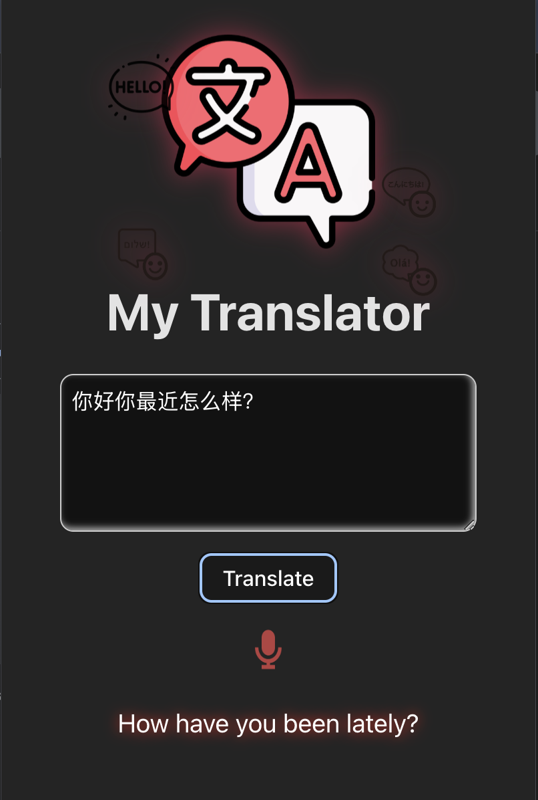
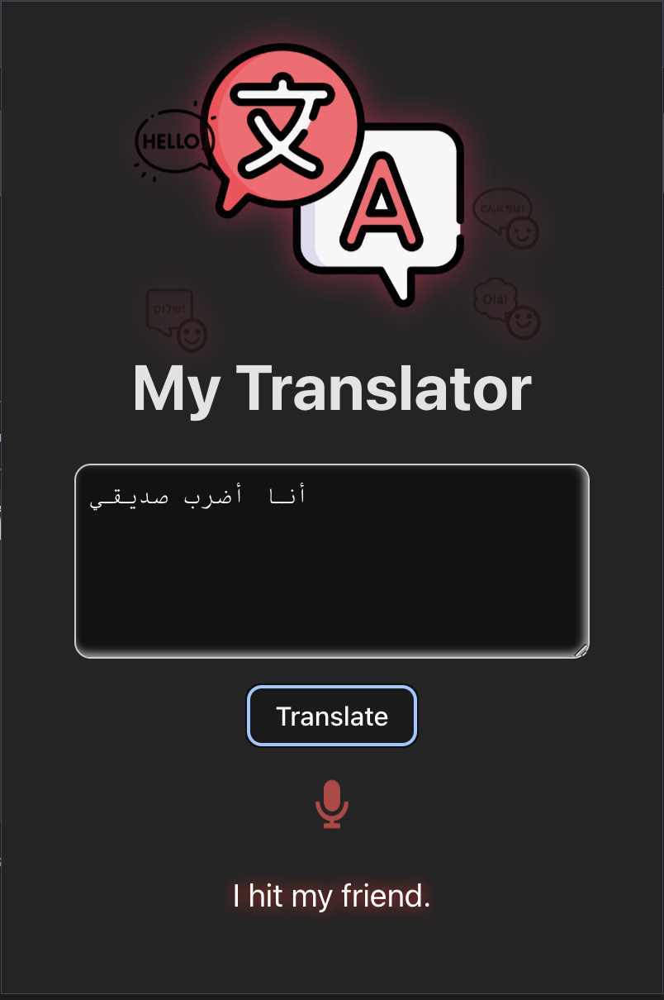
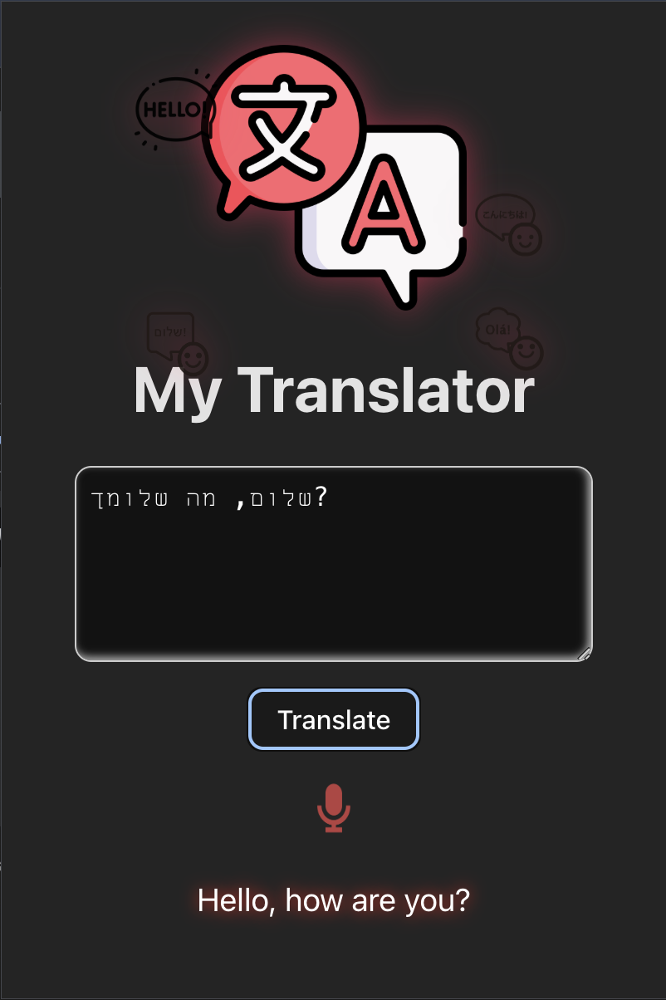

# Translator Chrome Extension

This repository contains the source code for a Chrome extension designed to simplify translations. The extension includes features for both text and voice translation, making it a versatile tool for users.

## Features

### 1. **Copy-Paste Translation**
Easily translate text by copying and pasting it into the extension. Perfect for quick and accurate translations.

<div style="display: flex; gap: 10px;">
  
  
  
</div>

### 2. **Voice-to-Text Translation**
Speak into your device, and the extension will convert your speech into text and translate it instantly. Ideal for hands-free usage and accessibility.

## Installation

1. Clone this repository to your local machine:
   ```bash
   git clone https://github.com/Armani-Romay/Translator-ChromeExtension.git
   ```

2. Open Chrome and navigate to `chrome://extensions/`.

3. Enable **Developer Mode** using the toggle in the top-right corner.

4. Click on **Load unpacked** and select the folder containing the cloned repository.

5. The Translator Chrome Extension will now appear in your extensions bar.

## Usage

1. Click on the extension icon in the Chrome toolbar.
2. Choose between "Text Translation" or "Voice Translation" mode.
3. Follow the prompts to input text or speak into your device.
4. View the translated text in real time.

## Technologies Used
- **TypeScript**: Core functionality and logic.
- **HTML/CSS**: User interface design.
- **Chrome Extensions API**: Integration with Chrome.

## Contributing
Contributions are welcome! If you find a bug or want to add a feature, feel free to open an issue or submit a pull request.

## License
This project is licensed under the [MIT License](LICENSE).

---

Enhance your browsing experience with quick and easy translations! 🌍

